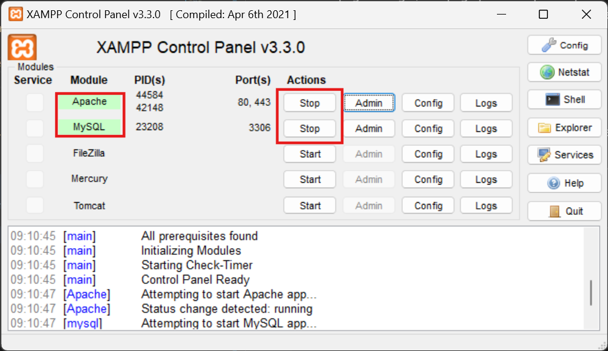

# 💊 Pharmatech 💊
## Lancement du projet 
Pour la semaine du ``17/06/2024 au 20/06/2024``, l'idée principale est de créer un outil de gestion de médicaments avec une page de login et une page de produits qui récupère des données à partir d'une base SQL hébergée localement. Pour commencer, nous avons cherché à trouver un nom pour le site web ("Pharmatech 💊"), puis nous avons installé ``XAMPP`` sur notre PC "local" : 

```
sudo winget install --id ApacheFriends.Xampp.8.2
```
Nous n'avons pas fait de configuration spéciale, il faut seulement lancer le serveur ``Apache`` et ``MySQL`` grâce à l'interface ``XAMPP`` : 




 >Cela nous a permis de mettre en place la base de données SQL et le serveur SQL pour pouvoir heberger le site web et avoir un retour sur les modification faites sur le code. 
<br>


## Structure de la base de donnée : 
```sql
-- Création de la base de données
CREATE DATABASE pharmatech;
```

### Création de la table Pharmatech en SQL dans la BDD pharmatech
```sql
CREATE TABLE medicaments (
    id INT AUTO_INCREMENT PRIMARY KEY,
    reference VARCHAR(255) NOT NULL,
    prix DECIMAL(10, 2) NOT NULL,
    derniere_modification DATE NOT NULL,
    quantite INT NOT NULL,
    description TEXT,
    fabriquant VARCHAR(255),
    type VARCHAR(50),
    img VARCHAR(255)
);
```
### Insertion des données dans la base SQL
```sql
INSERT INTO medicaments (reference, prix, derniere_modification, quantite, description, fabriquant, type, img) VALUES
('Paracetamol', 10.00, '2024-06-18', 30, 'xxx', 'Sanofi', 'Comprimés', 'img/paracetamol.jpg'),
('Ibuprofène', 12.00, '2025-06-30', 20, 'xxx', 'Pfizer', 'Capsule', 'img/ibuprofene.jpg'),
('Amoxicilline', 13.00, '2023-09-15', 10, 'xxx', 'GSK', 'Comprimés', 'img/amoxicilline.png'),
('Aspirine', 14.00, '2024-05-20', 5, 'xxx', 'Bayer', 'Comprimés', 'img/aspirine.png'),
('Oméprazole', 15.00, '2025-11-10', 20, 'xxx', 'AstraZeneca', 'Gélule', 'img/omeprazole.png');

```

On à créé cette strucutre avec differentes specificités tels que l'id (qui implémente +1 à chaque nouveau produit), le prix, la derniere modification, la quantité, la description, le fabriquant, le type et l'image du médicament. Cette base SQL permettera de realiser des opérations ``CRUD`` (create, read, update, delete) grâce à des opérations php. 

### Exemple : 


| id  | reference            | prix | derniere_modification | quantite | description | fabriquant  | type      | img                      |
|-----|----------------------|------|-----------------------|----------|-------------|-------------|-----------|--------------------------|
| 1   | Paracetamol | 10   | 2024-06-18 | 30 | xxx | Sanofi | Comprimés | img/paracetamol.jpg |
| 2   | Ibuprofène | 12   | 2025-06-30 | 20 | xxx | Pfizer | Capsule   | img/ibuprofene.jpg |
| 3   | Amoxicilline | 13   | 2023-09-15 | 10 | xxx | GSK | Comprimés | img/amoxicilline.png |
| 4   | Aspirine | 14   | 2024-05-20 | 5 | xxx | Bayer | Comprimés | img/aspirine.png |
| 5   | Oméprazole | 15   | 2025-11-10 | 20 | xxx | AstraZeneca | Gélule    | img/omeprazole.png |

<br>
<br>

# Explication du code

## L'index.php
### Partie PHP

```php
<?php
session_start();

if (isset($_SESSION['error_message'])) {
    $error_message = $_SESSION['error_message'];
    unset($_SESSION['error_message']);
} else {
    $error_message = null;
}

if (isset($_SESSION['logout_message'])) {
    $logout_message = $_SESSION['logout_message'];
    unset($_SESSION['logout_message']);
} else {
    $logout_message = null;
}
?>
```
Démarrage de la session php avec 

```php
session_start()
```

### Cette partie permet d'avoir le message de connexion refusée et de déconnexion 

Cette partie permet de verifier si il y'a un message de connexion lors de la connexion a la session : 

```php
if (isset($_SESSION['error_message'])) {
    $error_message = $_SESSION['error_message'];
    unset($_SESSION['error_message']);
} else {
    $error_message = null;
}
```
Si aucun message d'erreur est stocké dans la session la variable :

``isset`` C'est pour voir si une fonction est définie

```php
$error_message
```
Est initalisée sur null

#### Pour le logout c'est pareil 

```php
if (isset($_SESSION['logout_message'])) {
    $logout_message = $_SESSION['logout_message'];
    unset($_SESSION['logout_message']);
} else {
    $logout_message = null;
}
```
### Ensuite pour afficher le message de non connexion ou alors de déconnection il intéroge les differentes variables (error-message ou logout-message) 

#### Pour la connexion refusée : 

```php
if ($error_message) {
                echo '<p class="error-message">' . $error_message . '</p>';
    }
```

#### Pour la déconnexion : 

```php
if ($logout_message) {
                echo '<p class="logout-message">' . $logout_message . '</p>';
    }
```


### Ensuite il ya les balises HTML et les règles CSS 

> Nous ne commenterons pas le code HTML et CSS car ce n'est pas le sujet principal de ce projet.

Comme par exemple 
```css
.login {
        height: 460px;
        background: #eee;
        border-radius: 60% / 10%;
        transform: translateY(-180px);
        transition: .8s ease-in-out;
    }

    .login label {
        color: #573b8a;
        transform: scale(.6);
    }
```
#### Qui définit des règles CSS visuelles pour la partie Login


## Le login.php

#### Ce code permet de gérer les connexions utilisateur de manière simple en vérifiant les identifiants et en utilisant des redirections pour naviguer entre les pages en fonction du résultat de la vérification.

```php
if ($_SERVER["REQUEST_METHOD"] == "POST") {
    $email = $_POST['email'];
    $password = $_POST['password'];
    if ($email == "admin@pharmatech.com" && $password == "admin") {
        $_SESSION['username'] = "admin";
        header("Location: accueil.php");
        exit();
    } else {
        $_SESSION['error_message'] = "L'email ou le mot de passe est incorrect.";
        header("Location: index.php");
        exit();
    }
}
?>
```
Request des données envoyés via le formulaire POST pour l'email et le password.
```php
if ($_SERVER["REQUEST_METHOD"] == "POST") 
$email = $_POST['email'];
$password = $_POST['password'];
```
"La variable ``$email`` par exemple permet de stocker la valeur envoyée par l'utilisateur par le biais du formulaire." 

"``$_POST`` est un tableau qui contient differentes données envoyés par la méthode POST"

##### Cette opération est essentielle pour traiter les données entrés dans les formulaires web.

Ensuite cette partie permet de comparer les données assignés au variables ``$email`` et ``$password`` du tableau ``$_POST`` :

```php
if ($email == "admin" && $password == "admin") 
```
#### Afin de vérifier si le "l'email" et le "mot de passe" sont correct. 
 
### - Si cela est respecté alors :
```php
$_SESSION['username'] = "admin"; :
```
Alors le nom d'utilisateur est stocké afin de permettre de garder l'utilisateur connecté. (il n'y a pas de sécurité c'est en clair dans le code...)   

On est alors redirigé vers l'acceuil du site 
```php
header("Location: accueil.php");
``` 
(le ``header`` envoie un en-tête HTTP de redirection)
```php
exit();
```
Qui arrête l'exécution du script


### - Sinon : "else {"

On stocke dans le message d'erreur de connexion 

``['error_message']`` est la clé utilisée pour accéder à une valeur spécifique dans le tableau $_SESSION.

On stocke alors l'erreur dans ``error-message`` qui permettera d'afficher que la connexion (mot de passe ou utilisateur incorrect) sur la page login. 

Puis l'utilisateur est dedirigé sur la page ``index.php`` qui réaffiche alors le formulaire de connexion. 


```php
header("Location: index.php");
```

```php
exit();
```
Qui arrête l'exécution du script


